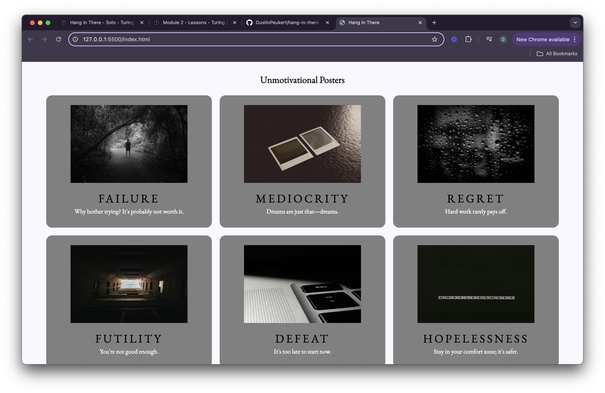

# Hang in There  

### Abstract:
[//]: <> (Briefly describe what you built and its features. What problem is the app solving? How does this application solve that problem?)
- This project is a web page. It allows the user to generate random motivational posters with predefined assets. It also allows the user to add their own assets when generating a custom poster. The page also has a section that contains unmotivational posters (which can be deleted by double clicking if the user so wishes).

### Installation Instructions:
[//]: <> (What steps does a person have to take to get your app cloned down and running?)
- Clone the project repo to your system
- cd into the project PATH
- In the main project directory, run this command in your terminal: `open index.html`

### Preview of App:
[//]: <> (Provide ONE gif or screenshot of your application - choose the "coolest" piece of functionality to show off. gifs preferred!)

### Context:
[//]: <> (Give some context for the project here. How long did you have to work on it? How far into the Turing program are you?)
- During this project, I was a Mod 2 student in the Turing program. 
- We started this project on the first day back from our break. 
- I had very little experience with HTML and Javascript, with no experience on their interactions with each other.
- I had no experience with CSS. 
- We were given roughly a week and a half to complete this project.

### Contributors:
[//]: <> (Who worked on this application? Link to your GitHub. Consider also providing LinkedIn link) 
- Dustin Peukert | [Github](https://github.com/DustinPeukert) | [LinkedIn](www.linkedin.com/in/dustin-peukert)

### Learning Goals:
[//]: <> (What were the learning goals of this project? What tech did you work with?) 
- To read, understand, and use existing code.
- Write clean, DRY Javascript:
- - Build out functionality using functions that show trends toward SRP.
- - Manipulate the page after it has loaded by adding, removing, and updating elements on the DOM.
- - Use array prototype iterator methods to reformat data and display it on the DOM.
- Use CSS and HTML to match styling and layout of provided comps.

I used the following tech/tools:

- VS Code
- Live Server VS Code Extension
- Javascript
- HTML
- CSS
- MDN Docs

### Wins + Challenges:
[//]: <> (What are 2-3 wins you have from this project? What were some challenges you faced - and how did you get over them?)
- I think my biggest win was being able to complete this project. It sounds simple, but I feel very proud about this fact since I came into it knowing almost nothing needed.
- Another win was implementing the poster deletion function. When I first began working on the problem I was struggling to grasp the structure of the DOM. As I researched and found a solution to my problem, my understanding of the DOM grew. 
- One of the major challenges I faced on this project was styling my unmotivational posters page. I was having difficulty figuring out why my button was stuck to the buttom of the page. And there was some confusion with the behavioral differences between padding and margins when it comes to buttons. I used chatGPT to start a dialogue about how attributes affect different elements, as well as how some attributes conflict with each other. Through this dialogue, I gained some valuable knowledge about CSS styling and was able to find the best solution I could in the time I had.